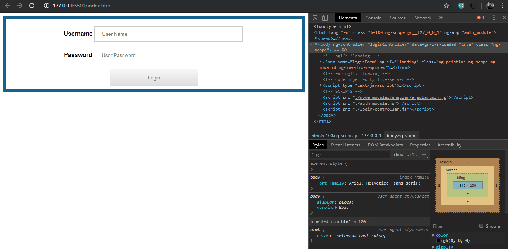

# User authentication using Node.js, Angular.js and SQL Server

##
This project demonstrates the integration of JavaScript (Node.Js) and Microsoft SQL Server 2016 for user authentication.

__Backend__

* Developed in JavaScript, running on Node.js and consuming data from Microsoft SQL Server 2016.

__Frontend__

* Developed in JavaScript using the AngularJS framework.

__Properties__
* Using model-view-controller (MVC) architecture
* SQL Server store procedure
* JavaScript frameworks
* REST Web Services
  #



## How to Use

```bash
# Clone this repository
$ git clone https://github.com/rminelli/user-auth-angular-node-sql-server

# Go into the repository
$ cd user-auth-angular-node-sql-server

# Install dependencies
$ npm install

# Run API service
$ cd .\auth_api
$ node index.js
```

__References__

* Node.js documentation 

https://nodejs.org/en/docs/

* Install SQL Server Express Edition from the Installation Wizard (Setup):

https://docs.microsoft.com/pt-br/sql/database-engine/install-windows/install-sql-server-from-the-installation-wizard-setup?view=sql-server-2017

* AngularJS documentation

https://docs.angularjs.org/api


##
 I am available for any questions.

 Best regards, 

 Roberto de Figueiredo Minelli
